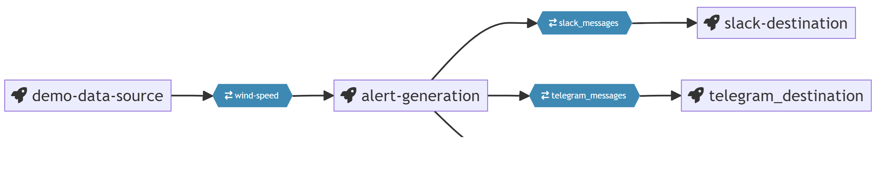

# quix-2024-hackathon

This pipeline is designed to:

 - Collect weather data for locations suitable for wind sports
 - Compare the location forecast wind speed and actual wind speed against user defined data
 - Alert the user via telegram or slack when a suitable forecast has been identified