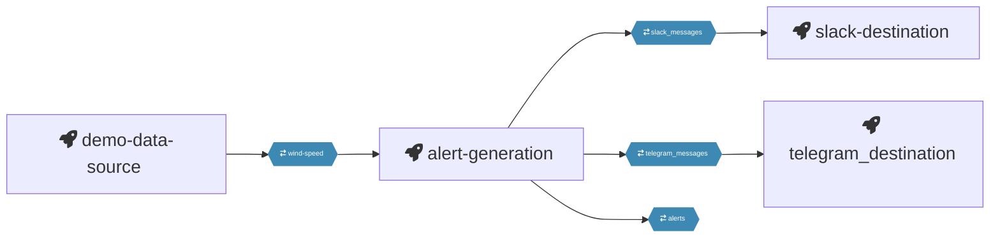

```mermaid
%%{ init: { 'flowchart': { 'curve': 'monotoneX' } } }%%
graph LR;
demo-data-source[fa:fa-rocket demo-data-source &#8205] --> wind-speed{{ fa:fa-arrow-right-arrow-left wind-speed &#8205}}:::topic;
wind-speed{{ fa:fa-arrow-right-arrow-left wind-speed &#8205}}:::topic --> alert-generation[fa:fa-rocket alert-generation &#8205];
alert-generation[fa:fa-rocket alert-generation &#8205] --> slack_messages{{ fa:fa-arrow-right-arrow-left slack_messages &#8205}}:::topic;
alert-generation[fa:fa-rocket alert-generation &#8205] --> telegram_messages{{ fa:fa-arrow-right-arrow-left telegram_messages &#8205}}:::topic;
alert-generation[fa:fa-rocket alert-generation &#8205] --> alerts{{ fa:fa-arrow-right-arrow-left alerts &#8205}}:::topic;
slack_messages{{ fa:fa-arrow-right-arrow-left slack_messages &#8205}}:::topic --> slack-destination[fa:fa-rocket slack-destination &#8205];
telegram_messages{{ fa:fa-arrow-right-arrow-left telegram_messages &#8205}}:::topic --> telegram_destination[fa:fa-rocket telegram_destination &#8205];


classDef default font-size:110%;
classDef topic font-size:80%;
classDef topic fill:#3E89B3;
classDef topic stroke:#3E89B3;
classDef topic color:white;
```